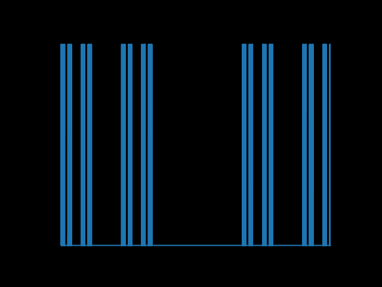

# Cantor set expansion

This is simple implementation of 1D fractal in python.

To run it, execute:

```
pip install -r requirements.txt
```

```
python ./cantor_fractal.py
```

You should receive something like below:  


